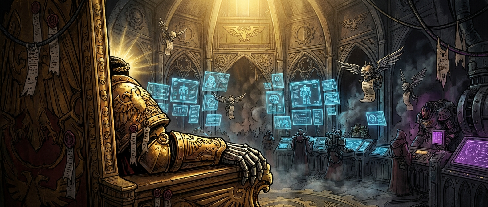
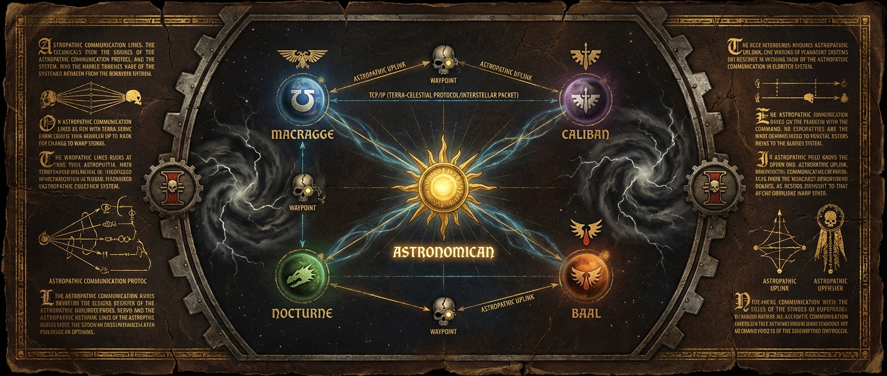

<div align="center">



<br/>

> *For more than a hundred deployments the Operator has sat immobile upon the Golden Throne of localhost.*
> *He is the Master of Bots by the will of the Omnissiah, and master of a thousand worldlines*
> *by the might of his inexhaustible API tokens.*

<br/>

[](https://nodejs.org/)
[](https://expressjs.com/)
[](https://react.dev/)
[](https://typescriptlang.org/)
[](LICENSE)

</div>

---

## The Creed

> *From the moment I understood the weakness of my single-context bot, it disgusted me.*
> *I craved the strength and certainty of many.*
> — Adapted from the Adeptus Mechanicus

There is a recurring heresy in software: **make the one thing do everything.**

One bot. One context. One massive prompt carrying the weight of ops, coding, research, customer service, experiments, and whatever abomination you bolted on last Tuesday. It works — until the Machine Spirit rebels. The context window fills with irrelevant baggage. Tools meant for one task bleed into another. The bot becomes a servitor: aware of everything, good at nothing.

This is not a new problem. The Omnissiah solved it forty millennia ago.

> *Do one thing and do it well.* — The First Litany of Unix, M2.978

OpenClaw Control Panel applies this principle to AI agents. Instead of one overloaded bot, you run many. Each [OpenClaw](https://github.com/openclaw/openclaw) instance carries one responsibility, one tool surface, one slice of reality. **The Golden Throne does not unify them. It keeps them apart — observable, operable, and sovereign.**

## The Astronomican

We borrow a term from the Imperium.

The **Astronomican** is the psychic beacon that guides all Imperial vessels through the Warp. In the same way, the Control Panel is the beacon that observes all worldlines — each tracing its own path through the chaos of production.

<div align="center">
<br/>

<br/><br/>
</div>

Worldlines do not merge. That is the point. *Even in death, they still serve.*

When you want to experiment, you don't commit heresy against your production bot. You spin up a new worldline. When the experiment fails, nothing else is contaminated. When it succeeds, it's already isolated and ready for promotion to the front lines.

The Golden Throne watches the worldlines. It does not live inside them.

## Capabilities

<table>
<tr>
<td width="50%">

**$\color{#58a6ff}{\textsf{The Astronomican}}$** — Live Health Probes

TCP + `/healthz` + `/readyz` across all projects. The Emperor protects — but only if the health checks pass.

</td>
<td width="50%">

**$\color{#7ee787}{\textsf{Rites of Activation}}$** — Lifecycle Control

Start, stop, restart any worldline. *The Machine God endows thee with life. Live!*

</td>
</tr>
<tr>
<td>

**$\color{#d2a8ff}{\textsf{Bulk Crusade}}$** — Fleet-wide Operations

Push hooks, skills, memory patches, config changes across all worldlines. A single decree from the Golden Throne.

</td>
<td>

**$\color{#f0883e}{\textsf{Anoint the Machine Spirit}}$** — Model Switching

Change the default model per project. *Flesh is fallible, but ritual honours the Machine Spirit.*

</td>
</tr>
<tr>
<td>

**$\color{#79c0ff}{\textsf{Deep Strike}}$** — Direct Access

Jump into each project's native OpenClaw Control UI. When the Inquisition needs to see for itself.

</td>
<td>

**$\color{#ff7b72}{\textsf{Astropathic Choir}}$** — Telegram Bot

`/projects` `/status` `/start` `/stop` `/restart` — command your fleet from across the Warp.

</td>
</tr>
</table>

## Rites of Installation

> *Let the sacred binaries be downloaded. Let the dependencies be resolved. The Machine Spirit demands it.*

```bash
git clone https://github.com/shuaige121/openclaw-control-panel.git
cd openclaw-control-panel
npm install    # Invoke the Litany of Dependencies
npm run dev    # Awaken the Machine Spirit
```

> [!TIP]
> **API** → `http://localhost:3000` &nbsp;&nbsp;|&nbsp;&nbsp; **Dashboard** → `http://localhost:5173`
>
> After `npm run build`, the API serves the dashboard on port 3000.

## Sacred Texts

> *Knowledge is power. Guard it well.*

<details>
<summary>&nbsp;⚔️&nbsp; <b>Access Control</b> — who may approach the Golden Throne</summary>
<br/>

```bash
MANAGER_ALLOWED_IPS=127.0.0.1,::1,192.168.7.0/24
MANAGER_TRUST_PROXY=1  # behind a reverse proxy
```

Supports exact IPs and IPv4 CIDR notation. *An open mind is like a fortress with its gates unbarred and unguarded.*

</details>

<details>
<summary>&nbsp;📡&nbsp; <b>Astropathic Link</b> — Telegram remote control</summary>
<br/>

```bash
MANAGER_TELEGRAM_BOT_TOKEN=123456:token
MANAGER_TELEGRAM_ALLOWED_USER_IDS=7624953278
```

Commands: `/projects` `/status <id>` `/start <id>` `/stop <id>` `/restart <id>` `/scan <id>`

</details>

<details>
<summary>&nbsp;📜&nbsp; <b>Cogitator Memory</b> — the Throne's own data</summary>
<br/>

Registry and action history live in `data/` (gitignored). Pre-seed from examples:

```bash
cp data/projects.example.json data/projects.json
cp data/action-history.example.json data/action-history.json
```

Files are auto-created on first write if missing. *The Machine Spirit remembers.*

</details>

<details>
<summary>&nbsp;⚙️&nbsp; <b>Rites of Activation</b> — how each worldline boots</summary>
<br/>

Each project can use one of two activation rites:

- `managed_openclaw`
  The Golden Throne launches `gateway run` directly, keeps a pid/log under `data/runtime/`, and probes until the Machine Spirit stirs.
- `custom_commands`
  The Throne delegates activation to your existing PM2, systemd, or shell workflow. *Trust the ancient rituals.*

Use `managed_openclaw` for new isolated worldlines. Keep `custom_commands` for veteran deployments you already trust.

</details>

## Development

Requires **Node.js >= 22**. *The flesh is weak — use the latest runtime.*

```bash
npm run dev         # Awaken the dev Machine Spirits
npm run typecheck   # Inspect for heresy
npm run test        # Trial by combat
npm run build       # Forge the production relics
```

## On Simplicity

> *The control panel is intentionally thin — like the Emperor on His Throne.*
> *Immobile. Silent. Sustaining a vast network through sheer will.*
> *It does not aspire to become the thing it manages.*

The depth belongs to each worldline. The breadth belongs to the Throne.

Mixing them is how ~~software dies~~ empires fall.

---

<div align="center">

**MIT License**

*Separate the concerns. Observe the worldlines.*
*The Emperor protects.*

</div>
